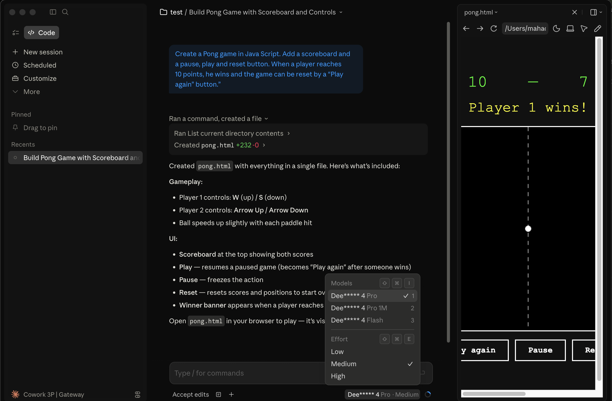

# Claude Desktop DeepSeek Launcher

Launch Claude Desktop in Cowork 3P mode with DeepSeek Cloud API.

This project writes Claude Desktop's 3P profile files, applies a gateway provider, starts a small local compatibility proxy, and opens or restarts Claude Desktop.

The proxy is needed because Claude Desktop sends some Anthropic-compatible request fields that DeepSeek validates more strictly. In particular, it normalizes `user_id` / `userid` values before forwarding requests to DeepSeek's Anthropic-compatible endpoint.

## Status

Experimental. Claude Desktop's Cowork 3P profile format is not a stable public plugin API, so future Claude Desktop updates can break this launcher.

Tested on macOS with Claude Desktop 3P mode. Windows paths are implemented but need broader testing.

## Requirements

- Claude Desktop installed
- Python 3.10 or newer
- A DeepSeek API key beginning with `sk-`
- macOS or Windows

## Quick Start

Clone the repo:

```bash
git clone https://github.com/mahadirz/claude-desktop-deepseek-launcher.git
cd claude-desktop-deepseek-launcher
```

Run the single-file launcher:

```bash
export DEEPSEEK_API_KEY="sk-..."
python3 launch_claude_desktop_deepseek.py --yes
```

Claude Desktop should open with a Claude route model. The local proxy maps that route to DeepSeek before forwarding the request:

```text
Claude-Mythos
Claude-Mythos 1M
```

Start a new conversation and send a prompt.

## Screenshot

Claude Desktop running in Cowork 3P mode through the DeepSeek gateway:



## Install As A CLI

From the repo directory:

```bash
python3 -m pip install .
export DEEPSEEK_API_KEY="sk-..."
claude-deepseek-launcher --yes
```

You can also run the package without installing:

```bash
PYTHONPATH=src python3 -m claude_deepseek_launcher --yes
```

## What It Changes

On macOS, the launcher writes these files:

```text
~/Library/Application Support/Claude/claude_desktop_config.json
~/Library/Application Support/Claude-3p/claude_desktop_config.json
~/Library/Application Support/Claude-3p/configLibrary/_meta.json
~/Library/Application Support/Claude-3p/configLibrary/00000000-0000-4000-8000-00000000d335.json
```

It creates timestamped `.bak` backups before overwriting existing JSON files.

By default, Claude Desktop is pointed at a local proxy:

```text
http://127.0.0.1:17631
```

The proxy forwards to:

```text
https://api.deepseek.com/anthropic/v1/messages
```

Proxy logs and PID are stored under Claude Desktop's 3P app data directory:

```text
~/Library/Application Support/Claude-3p/deepseek-launcher/
```

## Commands

Configure and launch:

```bash
python3 launch_claude_desktop_deepseek.py --api-key "sk-..." --yes
```

Configure without launching Claude Desktop:

```bash
python3 launch_claude_desktop_deepseek.py --api-key "sk-..." --no-launch
```

Preview config writes:

```bash
python3 launch_claude_desktop_deepseek.py --api-key "sk-..." --dry-run
```

Use a different local proxy port:

```bash
python3 launch_claude_desktop_deepseek.py --api-key "sk-..." --proxy-port 17632 --yes
```

Define custom Claude Desktop model names and map them to DeepSeek upstream models:

```bash
python3 launch_claude_desktop_deepseek.py \
  --api-key "sk-..." \
  --model-map "Claude Mythos Flash=deepseek-v4-flash" \
  --model-map "Claude Mythos=deepseek-v4-pro" \
  --yes
```

The `--model-map` format is `DISPLAY_NAME=DEEPSEEK_MODEL`. Claude Desktop still requires valid Anthropic route names internally, so the launcher assigns hidden Claude routes and uses `labelOverride` for the names you see in the picker.

If setup says a configured model was not returned by discovery, rerun the latest launcher. The launcher writes the model route map and restarts the local proxy so `/v1/models` returns the same hidden routes that Claude Desktop is configured to use.

The launcher also enables Cowork Auto Mode settings in Claude Desktop's 3P config. It sets `autoModeEnabled: true`, turns on the existing account permission bypass entries, and mirrors configured MCP servers into `managedMcpServers` with `toolPolicy` entries based on each server's `alwaysAllow` list.

Expose custom Anthropic route models:

```bash
python3 launch_claude_desktop_deepseek.py \
  --api-key "sk-..." \
  --model claude-sonnet-4-5 \
  --yes
```

Restore normal Claude Desktop mode:

```bash
python3 launch_claude_desktop_deepseek.py --restore --yes
```

## Development

Run the syntax and unit checks:

```bash
python3 -m compileall launch_claude_desktop_deepseek.py src tests
PYTHONPATH=src python3 -m unittest discover -s tests
```

## Why Not Point Directly At DeepSeek?

You can try direct mode:

```bash
python3 launch_claude_desktop_deepseek.py --api-key "sk-..." --direct --yes
```

In practice, direct mode can fail with errors like:

```text
401 Authentication Fails
400 Invalid 'user_id'
```

The default local proxy fixes those compatibility issues by:

- using `Authorization: Bearer sk-...`
- accepting Claude Desktop's query-string forms, such as `/v1/models?limit=1000`
- handling Claude Desktop's `/v1/messages/count_tokens` calls locally
- flushing streamed responses and closing proxy connections cleanly
- sanitizing `user_id` and `userid` values to DeepSeek's allowed pattern
- advertising valid Anthropic route names to Claude Desktop while rewriting those routes to DeepSeek upstream model names

## Troubleshooting

If Claude Desktop says `configured model "deepseek-v4-pro" is not an Anthropic model`, rerun the latest launcher. New Claude Desktop versions require `inferenceModels` to use Anthropic route names such as `claude-sonnet-4-5`; the proxy rewrites that route to DeepSeek upstream.

If authentication fails, make sure your key is set as `sk-...`, not `Bearer sk-...`:

```bash
export DEEPSEEK_API_KEY="sk-..."
```

Do not paste Claude Desktop's masked error text such as `****-...` back into setup. The launcher requires the full real DeepSeek API key and strips a `Bearer ` prefix automatically if you include one.

If the proxy fails to start, check the log:

```bash
tail -n 100 "$HOME/Library/Application Support/Claude-3p/deepseek-launcher/proxy.log"
```

If Claude Desktop keeps showing an old failed response, start a new conversation. Claude stores failed local-agent-mode sessions under its 3P app data.

## Security Notes

The launcher stores the DeepSeek API key in Claude Desktop's local 3P profile file because Claude Desktop expects a gateway credential there. Treat your Claude app data directory as secret-bearing local state.

Do not commit local Claude config files, `.env` files, logs, screenshots containing keys, or terminal output containing keys.

## License

MIT
